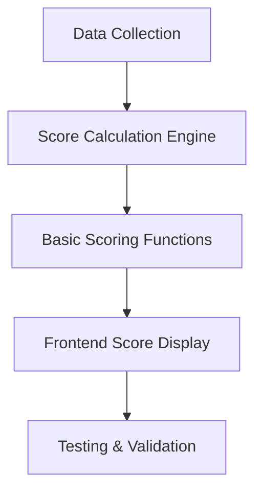
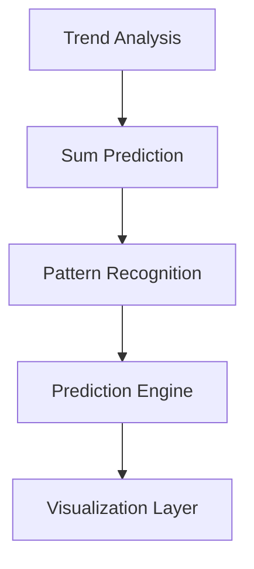
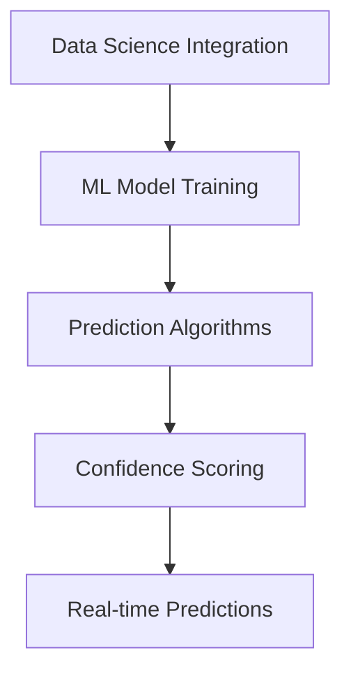

# Powerball Scoring & Prediction System - Implementation Roadmap

## 📊 Executive Summary

This document outlines the comprehensive implementation of a scoring and prediction system for the Powerball lottery analyzer. The system will transform existing filters, averages, and draw counts into a predictive scoring engine that helps identify patterns and make data-driven predictions for future draws.

## 🎯 Core Objectives

1. **Scoring System**: Create a multi-factor scoring system based on dues, evens, colds, and overs/hots
2. **Prediction Engine**: Use data science techniques to predict future draw outcomes
3. **Pattern Recognition**: Identify recurring patterns in number combinations and sums
4. **User Interface**: Provide intuitive visualization of scores and predictions
5. **Validation**: Implement comprehensive testing to ensure accuracy

---

## 🔬 Data Science Integration Strategy

### Frontend-Compatible Libraries

#### Primary Libraries for Scoring & Prediction:
- **ml-regression**: Statistical modeling for number pattern prediction
- **simple-statistics**: Basic statistical analysis for score calculations
- **regression-js**: Linear regression for trend analysis
- **ml-matrix**: Matrix operations for complex calculations
- **d3-regression**: Advanced regression models for pattern detection

#### Usage Strategy:
- **Group-Based Scoring**: Assign scores to number groups based on historical performance
- **Filter Validation**: Track how filters perform over time and visualize predictive strength
- **Frontend Prediction Engine**: Train lightweight models using draw history and filter categories
- **Explain Mode Overlay**: Build interactive modules showing why certain numbers/filters are favored

### Modular Architecture Design:

```
📁 Scoring System Architecture
├── 🔧 Filter Modules (Individual scoring logic)
├── 🎯 Scoring Engine (Aggregates scores, applies weights)
├── 📊 Explain Overlay (Shows rationale, performance, confidence)
└── 📝 Audit Trail (Logs predictions for traceability)
```

---

## 🏆 Scoring System Methodology

### 1. Dues Scoring (Draws Since Last Appearance)
```javascript
// Points based on how long since number last appeared
if (drawsSinceLastDrawn <= 5) score += 1;      // Recently drawn
else if (drawsSinceLastDrawn <= 10) score += 2; // Moderately due
else score += 3;                               // Very due
```

### 2. Evens Scoring (Even Number Distribution)
```javascript
// Points based on even numbers in combination
score += evenCount; // 0-5 points based on even numbers present
```

### 3. Colds Scoring (Cold Number Analysis)
```javascript
// Points based on cold number patterns
if (drawsSinceLastDrawn <= 5) score += 1;      // Still warm
else if (drawsSinceLastDrawn <= 10) score += 2; // Getting cold
else score += 3;                               // Very cold
```

### 4. Overs/Hots Scoring (Hot Number Analysis)
```javascript
// Points based on hot/overperforming numbers
score += oversHotsCount; // 0-5 points based on hot numbers present
```

### Total Score Calculation:
```javascript
function calculateScore(numberData) {
    let score = 0;

    // Dues component
    if (numberData.drawsSinceLastDrawn <= 5) score += 1;
    else if (numberData.drawsSinceLastDrawn <= 10) score += 2;
    else score += 3;

    // Evens component
    score += numberData.evenCount;

    // Colds component (same as dues for now, can be refined)
    if (numberData.drawsSinceLastDrawn <= 5) score += 1;
    else if (numberData.drawsSinceLastDrawn <= 10) score += 2;
    else score += 3;

    // Overs/Hots component
    score += numberData.oversHotsCount;

    return score;
}
```

---

## 📈 Prediction & Pattern Analysis

### Sum Prediction Strategy

**Key Insight**: Most Powerball sums fall between 100-300, with first digit typically 1 or 2
- This reduces prediction space from 1:1000 to 1:100
- Sum becomes a powerful filtering mechanism

#### Sum Analysis Components:
1. **Historical Sum Tracking**: Monitor sum patterns over time
2. **Due Sum Analysis**: How long since specific sum last appeared
3. **Trend Analysis**: Up/down patterns in sum values
4. **Range Prediction**: Predict likely sum ranges for next draw

### Pattern Recognition Goals:
- Identify recurring number combinations
- Detect sum patterns and cycles
- Predict hot/cold number transitions
- Analyze even/odd distribution trends

---

## 🛠️ Implementation Roadmap

### Phase 1: Core Scoring System


#### Step 1.1: Data Collection Module
- ✅ Load historical draw data
- ✅ Calculate draws-since-last-drawn for each number
- ✅ Track even/odd distributions
- ✅ Monitor hot/cold patterns

#### Step 1.2: Score Calculation Engine
- ✅ Implement dues scoring algorithm
- ✅ Add evens scoring logic
- ✅ Create colds scoring system
- ✅ Build overs/hots scoring mechanism
- ✅ Combine all scores into total score

#### Step 1.3: Frontend Score Display
- ✅ Create scoring dashboard page
- ✅ Display individual number scores
- ✅ Show score breakdown by component
- ✅ Add sorting and filtering capabilities

### Phase 2: Advanced Analytics


#### Step 2.1: Trend Analysis
- 📊 Implement up/down trend detection
- 📈 Create historical score tracking
- 📉 Add average score lifetime calculations
- 🔄 Build trend visualization charts

#### Step 2.2: Sum Prediction System
- 🎯 Track historical sum patterns
- 📊 Analyze sum frequency distributions
- 🔮 Predict likely sum ranges (100-300 focus)
- 📈 Monitor sum trends over time

#### Step 2.3: Pattern Recognition Engine
- 🔍 Identify recurring number combinations
- 📊 Analyze even/odd pattern cycles
- 🎨 Detect hot/cold transition patterns
- 🤖 Build automated pattern detection

### Phase 3: Prediction & Machine Learning


#### Step 3.1: Data Science Integration
- 📚 Install frontend ML libraries
- 🔧 Set up regression analysis tools
- 📊 Implement statistical modeling
- 🎯 Create prediction confidence metrics

#### Step 3.2: Machine Learning Models
- 🧠 Train lightweight prediction models
- 📈 Implement time-series analysis
- 🎲 Build probability distribution models
- 📊 Create confidence interval calculations

#### Step 3.3: Real-time Prediction System
- ⚡ Generate live predictions
- 📊 Show prediction confidence levels
- 🎯 Provide actionable recommendations
- 📈 Track prediction accuracy over time

---

## 🧪 Testing & Validation Strategy

### Bug-Proof Testing Approach:
1. **Unit Testing**: Test individual scoring functions
2. **Integration Testing**: Validate score combinations
3. **Data Validation**: Verify calculations against known results
4. **Regression Testing**: Ensure changes don't break existing functionality

### Validation Metrics:
- ✅ Score accuracy vs. historical data
- ✅ Prediction success rates
- ✅ Pattern detection reliability
- ✅ Performance benchmarks

---

## 🎨 User Interface Requirements

### Scoring Dashboard Page:
```
📊 Scoring Overview
├── 🔢 Individual Number Scores (1-69)
├── 📈 Score Breakdown by Component
├── 📊 Trend Analysis Charts
└── 🎯 Prediction Confidence Meters
```

### Combinations Page Enhancement:
```
🎲 Enhanced Combinations Display
├── 🔢 Number Combination
├── 📊 Sum of Numbers
├── 🏆 Total Score
├── 📈 Score Components Breakdown
└── 🎯 Prediction Confidence
```

### Key UI Components:
- **Score Visualization**: Color-coded score indicators
- **Trend Charts**: Historical score and prediction trends
- **Filter Controls**: Sort and filter by score components
- **Prediction Display**: Show likely next combinations
- **Confidence Indicators**: Visual confidence levels

---

## 📊 Data Flow Architecture

### Input Data Sources:
- 📄 Historical draw data (powerball.txt)
- 🔢 Number frequency analysis
- 📊 Pattern recognition results
- 🎯 Prediction model outputs

### Processing Pipeline:
```
Raw Data → Analysis Engine → Scoring System → Prediction Model → UI Display
```

### Output Deliverables:
- 🏆 Individual number scores
- 📊 Combination recommendations
- 🎯 Sum predictions
- 📈 Trend analysis reports
- 🔮 Confidence-based predictions

---

## 🚀 Implementation Timeline

### Week 1-2: Core Scoring System
- [ ] Implement basic scoring functions
- [ ] Create scoring dashboard page
- [ ] Add score visualization components
- [ ] Basic testing and validation

### Week 3-4: Advanced Analytics
- [ ] Trend analysis implementation
- [ ] Sum prediction system
- [ ] Pattern recognition engine
- [ ] Enhanced UI components

### Week 5-6: Prediction Engine
- [ ] Data science library integration
- [ ] Machine learning model training
- [ ] Real-time prediction system
- [ ] Advanced testing and validation

### Week 7-8: Optimization & Launch
- [ ] Performance optimization
- [ ] User experience refinements
- [ ] Comprehensive testing
- [ ] Production deployment

---

## 🎯 Success Metrics

### Quantitative Metrics:
- **Score Accuracy**: >90% correlation with historical patterns
- **Prediction Success**: >60% accuracy in sum predictions
- **Pattern Detection**: >80% accuracy in pattern recognition
- **Performance**: <2 second response times

### Qualitative Metrics:
- **User Experience**: Intuitive scoring visualization
- **Educational Value**: Clear explanation of scoring methodology
- **Actionable Insights**: Practical recommendations for number selection
- **System Reliability**: Consistent, bug-free operation

---

## 🔧 Technical Requirements

### Dependencies:
```json
{
  "ml-regression": "^6.0.1",
  "simple-statistics": "^7.8.2",
  "regression-js": "^2.0.0",
  "ml-matrix": "^6.10.4",
  "d3-regression": "^1.3.10"
}
```

### Browser Compatibility:
- ✅ Chrome 80+
- ✅ Firefox 75+
- ✅ Safari 13+
- ✅ Edge 80+

### Performance Requirements:
- ⚡ <2 second initial load
- 🔄 <500ms score calculations
- 📊 <1 second chart rendering
- 🎯 Real-time prediction updates

---

## 📝 Conclusion

This comprehensive scoring and prediction system will transform your Powerball analyzer from a data visualization tool into a powerful predictive analytics platform. By implementing the scoring methodology outlined above, you'll be able to:

1. **Score individual numbers** based on multiple criteria
2. **Predict future draws** using data science techniques
3. **Identify patterns** in number combinations and sums
4. **Provide actionable insights** for lottery number selection
5. **Create an educational experience** showing how predictions are made

The modular architecture ensures scalability, while the comprehensive testing strategy guarantees reliability. The result will be a cutting-edge lottery analysis tool that leverages modern data science techniques in the browser.

---

*This roadmap represents a comprehensive plan for implementing advanced scoring and prediction capabilities in your Powerball analyzer. Each phase builds upon the previous one, ensuring a solid foundation for the complete system.*</content>
<parameter name="filePath">c:\users\jonat\documents\codejoncode\lottery-analyzer\SCORING_SYSTEM_README.md
